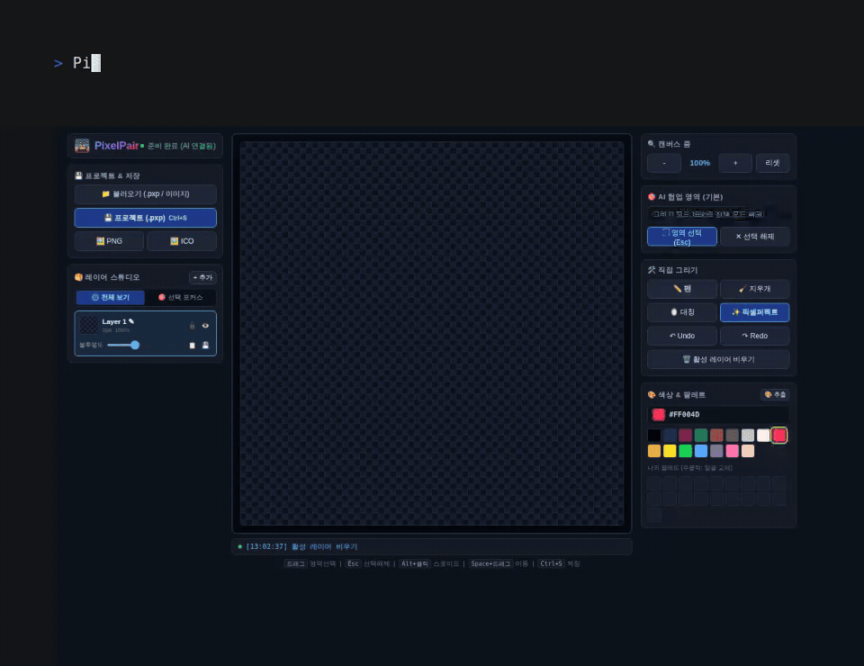

# PixelPair

**Draw pixel art together with your coding agent.**

PixelPair is a small, local-first 64×64 pixel editor where you and an MCP-capable coding agent work on the **same live canvas**. Draw by hand in the browser, then ask Claude Code, Codex, or another MCP client to inspect and modify the same image.

[한국어](README.ko.md)



> This README demo records real PixelPair MCP calls. For reproducibility, the recording script uses deterministic MCP operations while the terminal text illustrates the user request.

## Why PixelPair?

- **Human + AI, one canvas** — edits from the browser and the agent appear on the same live canvas.
- **Local-first** — the editor runs on `127.0.0.1`; PixelPair itself needs no account, cloud service, or AI API key.
- **MCP-native** — agents can inspect the canvas as an image, draw, transform regions, manage layers, and export results.
- **Built for pixel work** — layers, selection, symmetry, pixel-perfect lines, palette extraction, undo/redo, and nearest-neighbor export.
- **Simple project files** — save the complete layer stack as a single `.pxp` file.
- **Cross-platform** — Windows and Linux/WSL are runtime-tested; macOS builds are available but not yet runtime-verified.

PixelPair is intentionally focused. It is not trying to replace Aseprite; it is designed to make the **human ↔ coding-agent pixel-art loop** fast and visible.

## Quick start

### 1. Run PixelPair

Download the release for your platform, extract it, and run:

```text
Windows       win-x64/PixelPair.exe
Linux / WSL   ./linux-x64/PixelPair
macOS x64     ./osx-x64/PixelPair
macOS arm64   ./osx-arm64/PixelPair
```

PixelPair starts a local server and opens the editor in your default browser. If the browser does not open automatically, use the local URL printed in the console.

### 2. Pair a coding agent (optional)

**Ask your agent in one line:**

> Install https://github.com/ddunddun-labs/PixelPair and connect MCP.

The agent reads [`AGENTS.md`](AGENTS.md) and runs:

```bash
node scripts/agent-install.mjs --client cursor
```

Use `claude` or `codex` instead of `cursor` when that is your MCP client. **Restart the MCP client once** after install.

Verify:

```bash
node scripts/agent-install.mjs --check
```

For manual config only:

```bash
node scripts/agent-install.mjs --print --client cursor
```

<details>
<summary>Manual MCP registration (advanced)</summary>

Install Node.js, then register `mcp/pixelpair-mcp.mjs` (or `~/.pixelpair/mcp/pixelpair-mcp.mjs`) with your MCP client.

Claude Code:

```bash
claude mcp add --scope user pixelpair -- node /absolute/path/to/mcp/pixelpair-mcp.mjs
```

Codex:

```bash
codex mcp add pixelpair -- node /absolute/path/to/mcp/pixelpair-mcp.mjs
```

</details>

Restart the client after registration. The MCP bridge can discover a running PixelPair instance and, when used from a packaged distribution, can launch the matching local PixelPair binary when needed.

> Run PixelPair and its MCP process in the same OS environment. For example, use Windows PixelPair with Windows Node/MCP, or WSL PixelPair with WSL Node/MCP.

## What collaboration looks like

A typical loop is:

```text
You:    sketch or adjust pixels in the browser
Agent:  get_canvas → inspect the image/layers/selection
Agent:  draw or transform pixels through MCP
You:    refine the result by hand
Agent:  inspect again and continue
```

`get_canvas` can return the current canvas as a real MCP image content block. It also exposes the active selection and layer metadata, so an agent can work on a focused area instead of treating the image as an opaque file.

Locked layers are enforced by the server, so a locked layer cannot be modified through either the browser drawing path or MCP pixel-editing tools.

## Editor features

| Feature | Details |
| --- | --- |
| Canvas | 64×64 transparent pixel canvas with pan and zoom |
| Drawing | paint, erase, eyedropper, symmetry, pixel-perfect lines |
| Layers | add, remove, rename, duplicate, move, hide, lock, opacity, merge down |
| Selection | focus an area for human edits and agent operations |
| Palette | PICO-8 palette, custom palette, color extraction, recolor |
| History | undo / redo, up to 50 steps |
| Import | PNG, JPG, WEBP, BMP, GIF, ICO, clipboard, drag-and-drop |
| Project | save/load the full layer stack as `.pxp` |
| Export | PNG and multi-resolution ICO (16·24·32·48·64·128·256) |
| Preview | Live mini previews for 16×16, 32×32, and 48×48 icon scales |
| Live sync | browser updates through Server-Sent Events (SSE) |

## MCP tools

PixelPair exposes focused tools rather than requiring an agent to send thousands of individual pixels.

| Group | Tools |
| --- | --- |
| Inspect | `get_canvas`, `get_status`, `get_layers` |
| Draw | `set_pixels`, `fill_rect`, `clear_rect`, `draw_line`, `draw_circle`, `draw_ellipse`, `draw_polygon`, `round_corners` |
| Transform | `flood_erase`, `recolor`, `flip_rect`, `shift_rect`, `rotate_rect`, `center_canvas`, `scale_rect`, `outline_object`, `drop_shadow` |
| Batch | `apply_operations` |
| Layers | `add_layer`, `select_layer`, `remove_layer`, `rename_layer`, `duplicate_layer`, `move_layer`, `set_layer_visible`, `set_layer_locked`, `set_layer_opacity`, `merge_layer_down` |
| Project | `export_project`, `import_project` |
| Result/history | `export_icon`, `undo`, `redo` |

For larger edits, prefer semantic operations such as `fill_rect`, `recolor`, transform tools (`center_canvas`, `scale_rect`, `outline_object`, `drop_shadow` etc.), or `apply_operations`. Use `set_pixels` for small precision fixes.

- **`center_canvas`**: Computes the bounding box of active layer pixels and centers the drawing within the 64×64 canvas (`axis`: `both`, `horizontal`, `vertical`).
- **`scale_rect`**: Rescales a drawing or region using nearest-neighbor interpolation without blurring pixel art. Automatically detects character bounding boxes if coordinates (`x, y, w, h`) are omitted.
- **`outline_object`**: Generates a crisp 1-pixel border around drawings for icon/sticker styling (`color`, `diagonal` 8-way support).
- **`drop_shadow`**: Adds silhouette offset shadows (`type="object"`) or soft ground oval shadows (`type="ground"`) to give depth.
- **`apply_operations`**: Batches multiple shapes, recoloring, scaling, outlines, and shadows into a single atomic request with 1-step undo history.

## Local security model

PixelPair is designed as a local desktop-style tool:

- the HTTP server binds only to `127.0.0.1`;
- browser requests are restricted to PixelPair's own origin instead of using wildcard CORS;
- JSON operations that read or write arbitrary local file paths require a per-run local agent token;
- the official MCP bridge discovers that token locally and sends it automatically;
- the token is not intended to be copied into prompts, logs, or public configuration.

The browser can still upload image bytes directly without giving the page arbitrary filesystem access.

## Build from source

Requirements:

- .NET 10 SDK
- Node.js if you want MCP integration
- Python 3 for the smoke-test harness

```bash
git clone https://github.com/ddunddun-labs/PixelPair.git
cd PixelPair
dotnet run
```

Basic verification:

```bash
dotnet build PixelPair.csproj -c Release
node --check mcp/pixelpair-mcp.mjs
node --check wwwroot/app.js
python tests/smoke_test.py
```

The smoke test expects a PixelPair server to be running. It covers the local security policy, agent-token path operations, layer locking, selection-aware recolor, opacity-preserving merge-down, and an MCP export round trip.

## Reproduce the README demo

The repository includes a deterministic demo workflow for maintainers. It uses Playwright for the browser recording, VHS for the terminal segment, PixelPair MCP for the canvas operations, and ffmpeg for compositing/encoding.

This workflow is currently tested on Linux/WSL and requires `vhs`, `ffmpeg`, and Playwright's Chromium browser in addition to Node.js.

```bash
npm install
npx playwright install chromium
npm run demo:readme
```

PixelPair must already be running. The command writes a temporary MP4 under `/tmp/pixelpair-readme-demo/` and regenerates the checked-in README GIF at `docs/demo/pixelpair-collaboration.gif`.

## Releases

Pushing a `v*` tag triggers the release workflow, which builds self-contained packages for:

- Windows x64
- Linux x64
- macOS x64
- macOS arm64

Windows and Linux/WSL have been runtime-tested. macOS packages currently build successfully but still need runtime verification on real macOS hardware.

## Project format

`.pxp` is PixelPair's JSON-based project format. It stores the layer stack, layer metadata, active layer, and pixel data so a working project can be restored instead of only exporting a flattened image.

## Contributing

Issues and pull requests are welcome. Before making a large change, please open an issue first so the scope can stay aligned with PixelPair's focused human + coding-agent workflow.

## License

PixelPair source code is licensed under the [MIT License](LICENSE). Third-party dependencies retain their own licenses.
